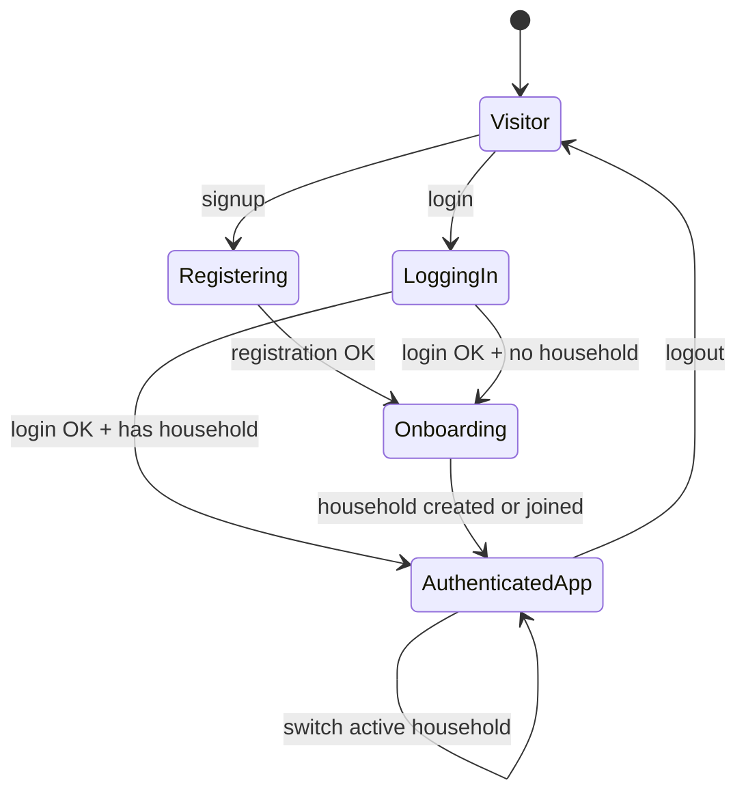

# HOEM — Information Architecture

**Version:** 1.1
**Date:** 2026-05-12
**Standards applied:**
- Peter Morville's **Information Architecture** principles — findability, understandability, usability
- **Nielsen Norman Group** navigation patterns
- **REST URL conventions** (RFC 3986 + Roy Fielding REST best practices)
- **Mermaid.js** notation for diagrams

---

## 1. What is Information Architecture and Why It Matters

Information Architecture (IA) defines **how product information is organised** so that users find what they are looking for without having to think. It covers four systems:

1. **Organisation system** — how we group content.
2. **Labelling system** — how we name things.
3. **Navigation system** — how the user moves between screens.
4. **Search system** — how they find specific content.

Poor IA does not show up as a bug — it shows up as frustration. That is why it is designed before wireframes.

---

## 2. Content Inventory

### 2.1 Main Data Entities

| Entity | Key attributes | Relationships | Owning service |
|---|---|---|---|
| **User** | id, email, name, avatar, language, timezone | Belongs to 1..N households | auth-service |
| **Household** | id, name, type, invite_code, created_at | Has 1..N members | auth-service |
| **Membership** | user, household, role, color, joined_at | Joins User and Household | auth-service |
| **Pantry Product** | id, name, category, quantity, unit, expiry, min_quantity | Belongs to 1 household | pantry-service |
| **Shopping List** | id, name, status, created_at | Belongs to 1 household | shopping-service |
| **List Item** | product, quantity, checked, checked_by | Belongs to 1 list | shopping-service |
| **Task** | id, title, description, priority, due_date, recurrence, status | Assigned to N members | tasks-service |
| **Recipe** | id, name, description, category, difficulty, prep_time, cook_time, servings, is_global | Belongs to 1 household or global | menu-service |
| **Recipe Step** | recipe, step_number, instruction, duration_min | Belongs to 1 recipe | menu-service |
| **Recipe Ingredient** | recipe, name, quantity, unit, is_optional | Belongs to 1 recipe | menu-service |
| **Weekly Menu** | week, slots (day × meal) | Belongs to 1 household | menu-service |
| **Electricity Price** | hour, price_kwh, price_band | ESIOS cache | energy-service |
| **Energy Alert** | household, threshold_kwh, active, notify channels | Belongs to 1 household | energy-service |
| **Appliance** | id, name, power_watts, avg_duration_min, is_flexible | Belongs to 1 household | energy-service |

### 2.2 Screen Types

| Type | Examples | Pattern |
|---|---|---|
| **Dashboard** | Home | Aggregated summary of all modules |
| **List** | Product list, task list, recipe list | Table/grid with filters and search |
| **Detail** | Product detail, task detail, recipe detail | Single view with contextual actions |
| **Form** | Create product, edit recipe, configure appliance | Fields + validation + save/cancel |
| **Plan/Calendar** | Weekly menu, task calendar | Time-based grid view |
| **Visualisation** | 24h electricity price chart, savings statistics | Charts + real-time data |
| **Settings** | Household settings, user profile, energy alerts | Grouped sections |
| **Onboarding** | Initial steps after registration | Linear flow with progress |

---

## 3. Sitemap

> **Design decision:** flat navigation with 6 main sections. Energy has its own section because it is a product differentiator and deserves visibility in the primary navigation.

```mermaid
graph TD
    Root[HOEM]

    Root --> Public[Public zone]
    Root --> Onboarding[Onboarding]
    Root --> App[Authenticated app]
    Root --> Settings[Settings]

    Public --> Landing[Landing /]
    Public --> Login[Login /login]
    Public --> Signup[Sign up /signup]
    Public --> Forgot[Password recovery /forgot-password]
    Public --> Privacy[Privacy /privacy]
    Public --> Terms[Terms /terms]

    Onboarding --> O1[1 · Welcome]
    Onboarding --> O2[2 · Create or join household]
    Onboarding --> O3[3 · Household type]
    Onboarding --> O4[4 · Modules to activate]
    Onboarding --> O5[5 · Ready]

    App --> Home[Home /app]
    App --> Pantry[Pantry /app/pantry]
    App --> Shop[Shopping /app/shopping]
    App --> Tasks[Tasks /app/tasks]
    App --> Menu[Menu /app/menu]
    App --> Energy[Energy /app/energy]

    Pantry --> PList[Product list]
    Pantry --> PDetail[Product detail]
    Pantry --> PNew[Add product]

    Shop --> SLists[My lists]
    Shop --> SDetail[List detail]
    Shop --> SNew[Create list]

    Tasks --> TBoard[Board / day view]
    Tasks --> TCalendar[Weekly calendar]
    Tasks --> TDetail[Task detail]
    Tasks --> TNew[New task]

    Menu --> MPlan[Weekly plan]
    Menu --> MRecipes[Recipe library]
    Menu --> MRDetail[Recipe detail]
    Menu --> MRNew[New recipe]

    Energy --> EOverview[Current price and 24h forecast]
    Energy --> EAlerts[My alerts]
    Energy --> EAppliances[My appliances]
    Energy --> EHistory[Savings history]

    Settings --> SHousehold[Household]
    Settings --> SMembers[Members]
    Settings --> SProfile[My profile]
    Settings --> SNotif[Notifications]
    Settings --> SAccount[Account and privacy]
```



---

## 4. Navigation Patterns

### 4.1 Primary Navigation

6 destinations accessible from anywhere in the app:

| Label | Suggested icon | Base URL |
|---|----------------|---|
| Home | house          | `/app` |
| Pantry | food           | `/app/pantry` |
| Shopping | shopping cart  | `/app/shopping` |
| Tasks | checkbox       | `/app/tasks` |
| Menu | frypan         | `/app/menu` |
| Energy | thunder        | `/app/energy` |

> **Labelling decision:** "Energy" instead of "Electricity" or "PVPC". Users perceive the module as general energy consumption management, not just an electricity price viewer. This leaves room to expand the module in the future without renaming it.

### 4.2 Secondary Navigation

Contextual to each section. Examples:

- **Pantry:** tabs `All`, `Low stock`, `Expiring soon`
- **Energy:** tabs `Now`, `24h forecast`, `My alerts`
- **Tasks:** tabs `Today`, `Week`, `Month`

### 4.3 Contextual Navigation

- **Active household:** dropdown in the header to switch between households.
- **User:** avatar menu in the top-right corner.
- **Breadcrumbs:** on deep detail screens.

### 4.4 Responsive Adaptation

| Viewport | Primary navigation pattern |
|---|---|
| **Mobile** (< 768 px) | Bottom navigation with 6 icons |
| **Tablet** (768–1024 px) | Collapsible sidebar with icons + text |
| **Desktop** (≥ 1024 px) | Fixed left sidebar with text and icons |

---

## 5. URL Structure

### 5.1 Public

```
GET  /                      Landing page
GET  /login                 Login screen
GET  /signup                Registration
GET  /forgot-password       Password recovery
GET  /privacy               Privacy policy
GET  /terms                 Terms of use
```

### 5.2 Authenticated (app)

```
GET  /app                        Active household dashboard

GET  /app/pantry                 Product list
GET  /app/pantry/:id             Product detail
GET  /app/pantry/new             Create product

GET  /app/shopping               My shopping lists
GET  /app/shopping/:id           List detail
GET  /app/shopping/new           New list

GET  /app/tasks                  Tasks (default view: today)
GET  /app/tasks/calendar         Weekly calendar
GET  /app/tasks/:id              Task detail

GET  /app/menu                   Weekly menu
GET  /app/menu/recipes           Recipe library
GET  /app/menu/recipes/:id       Recipe detail
GET  /app/menu/recipes/new       New recipe

GET  /app/energy                 Current price + 24h forecast
GET  /app/energy/alerts          My configured alerts
GET  /app/energy/appliances      My appliances
GET  /app/energy/history         Estimated savings history

GET  /app/household              Household information
GET  /app/household/members      Members
GET  /app/household/invite       Invite member

GET  /app/profile                My profile
GET  /app/profile/notifications  Notification settings
GET  /app/profile/account        Account and privacy
```

### 5.3 REST API (per service, through the API Gateway)

Convention: `/api/v1/{resource}`. The gateway routes internally to the correct service.

```
# auth-service
POST   /api/v1/auth/register
POST   /api/v1/auth/login
POST   /api/v1/auth/refresh
POST   /api/v1/auth/forgot-password
GET    /api/v1/households
POST   /api/v1/households
GET    /api/v1/households/:id/members
POST   /api/v1/households/:id/join-requests
PATCH  /api/v1/households/:id/join-requests/:requestId

# pantry-service
GET    /api/v1/pantry
POST   /api/v1/pantry
GET    /api/v1/pantry/:id
PATCH  /api/v1/pantry/:id
DELETE /api/v1/pantry/:id

# shopping-service
GET    /api/v1/shopping-lists
POST   /api/v1/shopping-lists
GET    /api/v1/shopping-lists/:id
GET    /api/v1/shopping-lists/:id/snapshot
PATCH  /api/v1/shopping-lists/:id/items/:itemId

# tasks-service
GET    /api/v1/tasks
POST   /api/v1/tasks
GET    /api/v1/tasks/:id
PATCH  /api/v1/tasks/:id
DELETE /api/v1/tasks/:id

# menu-service
GET    /api/v1/recipes
POST   /api/v1/recipes
GET    /api/v1/recipes/:id
GET    /api/v1/meal-plans/current
PUT    /api/v1/meal-plans/current/slots/:slotId
POST   /api/v1/meal-plans/current/generate-shopping-list

# energy-service
GET    /api/v1/energy/current-price
GET    /api/v1/energy/forecast
GET    /api/v1/energy/daily-stats
GET    /api/v1/energy/recommendations
GET    /api/v1/energy/alerts
POST   /api/v1/energy/alerts
GET    /api/v1/energy/appliances
POST   /api/v1/energy/appliances
GET    /api/v1/energy/savings
```

---

## 6. Authentication State Diagram



**Rules:**

- A visitor trying to access `/app/*` is redirected to `/login?next=CURRENT_URL`.
- An authenticated user with no household is redirected to `/onboarding`.
- A user on `/login` with an active session is redirected to `/app`.

---

## 7. Information Density per Screen

| Screen | Density | Reason |
|---|---|---|
| Home (dashboard) | **Medium-high** | Summary of all 5 modules. Quick snapshot of household state |
| Pantry (list) | **High** | Inventory list, may have 50+ items |
| Product detail | **Low** | Focus on a single entity |
| Shopping list | **Medium** | Items with checkboxes, grouped by category |
| Tasks (day view) | **Medium** | What to do today, grouped by member |
| Weekly menu | **Medium** | 7×2 grid |
| Energy — current price | **Low** | One large, clear, actionable number |
| Energy — 24h forecast | **Medium** | Hourly bar chart with cheap/medium/expensive bands |
| Energy — recommendations | **Low** | 2–3 recommendations for the day, no noise |
| Onboarding | **Very low** | One decision per screen |

---

## Changelog

| Version | Date | Changes |
|---|---|---|
| 0.1 | 2026-05-10 | Initial version (5 modules without energy) |
| 1.0 | 2026-05-10 | Energy module added to sitemap, navigation, URLs and density. Energy entities added to inventory |
| 1.1 | 2026-05-12 | Translated to English. Entities updated: invite_code and color added to Household/Membership. Recipe entity expanded with steps, prep/cook time, difficulty, is_global. Price band (cheap/medium/expensive) added to Electricity Price entity. join-requests endpoints added to REST API |
