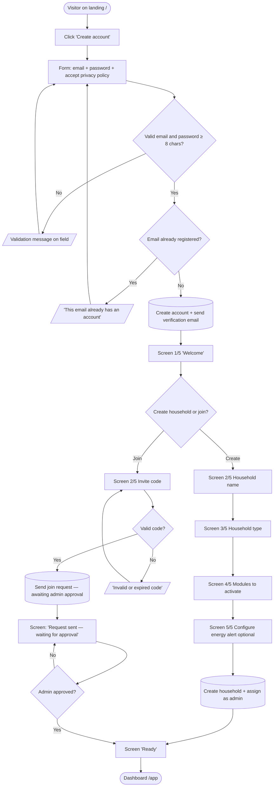
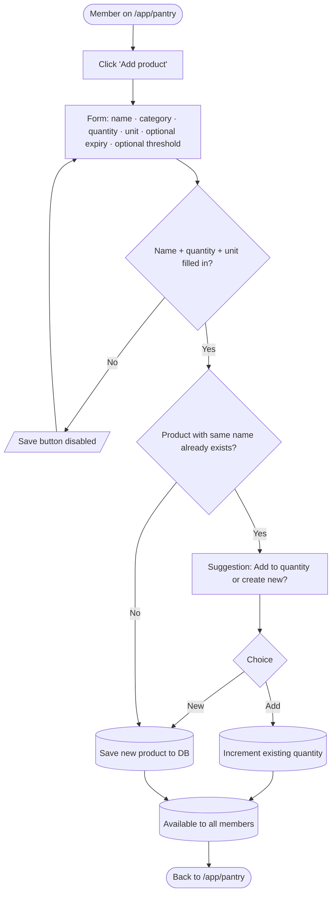
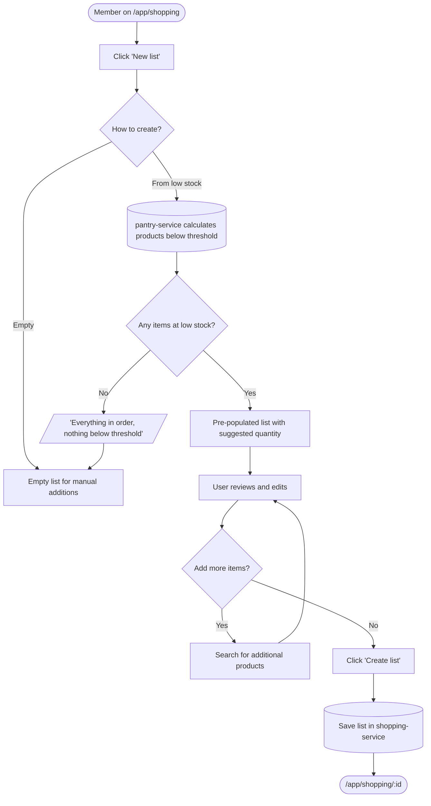
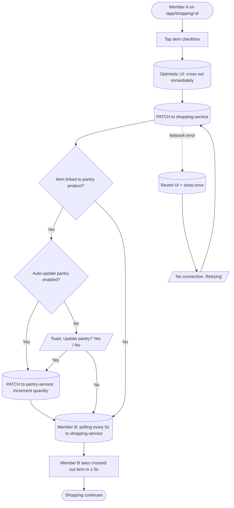
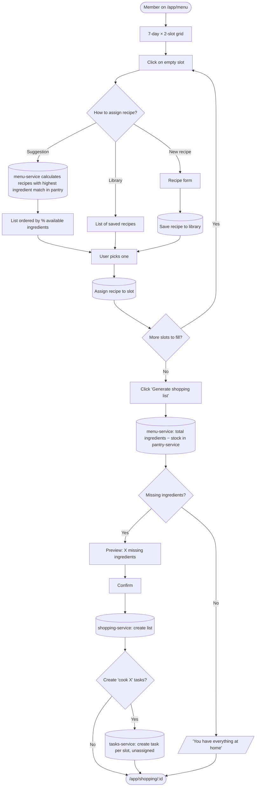
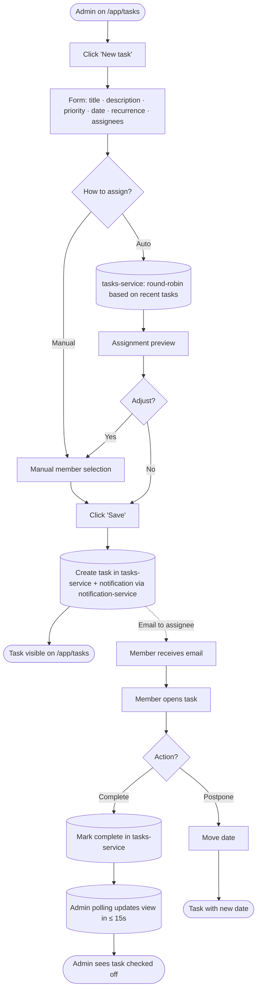
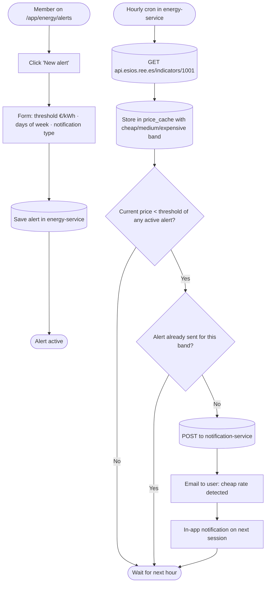

# HOEM — User Flows

**Version:** 1.1
**Date:** 2026-05-12
**Standards applied:**
- Simplified **BPMN 2.0** (ISO/IEC 19510:2013)
- Adobe XD UX flow conventions
- **Mermaid.js** diagrams

---

## 1. What is a User Flow and Why Do We Need It?

A user flow describes the exact path a user takes to complete a task. While user stories say *what* the user does and wireframes show *how it looks*, user flows answer *how they do it*: screen by screen, decision by decision, including errors and alternative paths.

Without user flows, wireframes end up representing only the happy path and edge cases are discovered late, once code has already been written.

---

## 2. Notation Legend

| Symbol | Meaning |
|---|---|
| `([text])` | Flow start or end |
| `[text]` | Screen or user action |
| `{text?}` | Decision or validation |
| `[(text)]` | Background system action |
| `[/text/]` | Error message or feedback |
| `-->` | Main flow |
| `-->|condition|` | Conditional path |

---

## 3. Flow Summary

| ID | Flow | Actor | Criticality | Frequency |
|---|---|---|---|---|
| UF-01 | Full onboarding | Visitor → User | 🔴 Critical | Once per user |
| UF-02 | Add product to pantry | Member | 🔴 Critical | Multiple times/week |
| UF-03 | Generate list from low stock | Member | 🟠 High | 1–2 times/week |
| UF-04 | Mark item as purchased | Member | 🔴 Critical | Multiple times/session |
| UF-05 | Plan weekly menu + generate list | Member | 🟠 High | Once/week |
| UF-06 | Assign task and complete it | Admin + Member | 🟠 High | Daily |
| UF-07 | Configure and receive energy alert | Member | 🟠 High | Configure once, alert daily |
| UF-08 | Check electricity price and recommendations | Member | 🟡 Medium | Daily |

---

## 4. UF-01 — Full Onboarding

**Trigger:** a visitor arrives at the HOEM landing page and decides to register.
**Success criterion:** user reaches the dashboard with at least 1 active household in under 3 minutes.



**Edge cases:**
- If the user abandons after creating an account but before having a household, on return they are redirected to `/onboarding` from step 2.
- Email verification does not block the flow. The user can use the app and is reminded to verify. If they do not verify within 7 days, notification emails are disabled.
- Energy alert configuration in onboarding is optional. It can be configured later from `/app/energy/alerts`.

---

## 5. UF-02 — Add Product to Pantry

**Trigger:** member wants to record a product they just bought.
**Success criterion:** the product appears in all members' list in < 2 seconds.



---

## 6. UF-03 — Generate Shopping List from Low Stock

**Trigger:** member wants to prepare the weekly shop without thinking about it manually.
**Success criterion:** pre-populated list with low-stock products, editable before confirming.



---

## 7. UF-04 — Mark Item as Purchased (Multi-member Sync)

**Trigger:** member is at the supermarket marking what they pick up.
**Success criterion:** item is crossed out for them immediately and for other members in ≤ 5 seconds.



**Design decisions:**
1. **Optimistic UI:** the item is crossed out before the server confirms. If it fails, it is reverted.
2. **Polling every 5s:** shopping-service returns only items modified since `lastUpdatedAt`. If no changes, responds 304 Not Modified with no body.
3. **Conflict:** last-write-wins. Toast "Another member just modified this" when conflict detected via `updatedAt`.

---

## 8. UF-05 — Plan Weekly Menu and Generate Shopping List

**Trigger:** member does the weekly planning (typically Sunday).
**Success criterion:** 7-day menu planned and shopping list calculated in under 5 minutes.



**Design decisions:**
1. **Rule-based suggestions:** menu-service compares each recipe's ingredients with pantry-service stock and sorts by match percentage. No ML. Calculation is deterministic and fast.
2. **Missing ingredients:** only for products linked to the pantry. If an ingredient has never been added to the pantry, it is considered missing.
3. **Task creation is optional:** toggle defaults to `off`. Avoids spamming the tasks section.

---

## 9. UF-06 — Assign Task and Complete It (Multi-member)

**Trigger:** admin wants to distribute a task among members.
**Success criterion:** task appears on the member's dashboard in < 5s and when completed the admin sees it without refreshing.



**Design decisions:**
1. **Automatic distribution:** simple round-robin in v1 (rotates among active household members). More sophisticated algorithm in v2.
2. **Notifications:** email only in MVP (via notification-service + Resend). Push notifications in v2.
3. **Permissions:** `member` can complete and postpone tasks assigned to them. `admin` can do everything.

---

## 10. UF-07 — Configure and Receive Energy Alert

**Trigger:** user wants to know when electricity is cheapest without having to check the app.
**Success criterion:** user receives an email or in-app notification when a cheap rate starts according to their configured threshold.



**Design decisions:**
1. **Hourly cron:** PVPC prices change hour by hour. More frequent evaluation adds no value.
2. **Deduplication:** alert is sent only once per cheap window (not every time the cron evaluates within the same cheap hour).
3. **ESIOS fallback:** if the API does not respond, previous day's cached price is used. No alerts are sent if data is more than 25 hours old.

---

## 11. UF-08 — Check Electricity Price and Daily Recommendations

**Trigger:** user wants to know whether now is a good time to run appliances.
**Success criterion:** in fewer than 2 taps the user has the current price and the day's recommendation.

```mermaid
flowchart TD
    Start([Member on /app]) --> Nav[Tap 'Energy' in navigation]
    Nav --> Overview[Screen /app/energy]
    Overview --> Data[(energy-service: read from price_cache)]
    Data --> Fresh{Data < 1 hour old?}
    Fresh -->|Yes| Show[Show current price + band + 24h chart]
    Fresh -->|No| Stale[Show data with notice 'Updating...']
    Show --> Recs[Daily recommendations section]
    Recs --> HasAppliances{Has configured appliances?}
    HasAppliances -->|Yes| ShowRecs[Best time for each appliance + estimated saving]
    HasAppliances -->|No| Prompt[CTA: 'Add your appliances for personalised recommendations']
    ShowRecs --> End([User acts or closes])
    Prompt --> AddAppliance[/app/energy/appliances]
    AddAppliance --> End
```

---

## 12. Cross-Cutting Error States

| State | Cause | UX treatment |
|---|---|---|
| No connection | Network down | Banner: "No connection. Changes will sync when reconnected." |
| Session expired | JWT expired | Modal: "Your session has expired." → redirect to `/login?next=CURRENT_URL` |
| No permissions | Member tries admin action | Toast: "Only the administrator can do this." |
| Service down | Microservice not responding | Inline message with "Retry" button. Never a blank screen |
| ESIOS unavailable | Red Eléctrica API down | In energy module: "Using data from X hours ago." App keeps working |
| Data conflict | Another member modified at the same time | Toast: "Another member just modified this." Last-write-wins |

---

## 13. Open Decisions to Validate in Testing

1. **UF-04:** is the "auto-update pantry" toggle configured per household or per user? MVP: per household.
2. **UF-05:** are recipe suggestions sorted by % match sufficiently useful? Validate with beta users before adding more criteria.
3. **UF-07:** should the default alert threshold be pre-configured (e.g. 0.12 €/kWh) or empty? Hypothesis: pre-configured at 0.12 €/kWh with option to change.
4. **UF-08:** does the energy screen show the 24h chart by default or just the large current price? Hypothesis: large price first, chart on scroll or tab.

---

## Changelog

| Version | Date | Changes |
|---|---|---|
| 0.1 | 2026-05-10 | Initial version (6 flows, no energy) |
| 1.0 | 2026-05-10 | UF-07 and UF-08 added (energy module). Synchronisation updated to polling. References to specific microservices added |
| 1.1 | 2026-05-12 | Translated to English. UF-01 updated to reflect admin approval flow for join requests. UF-04 polling updated to 5s. UF-07 updated to reflect cheap/medium/expensive price bands |
